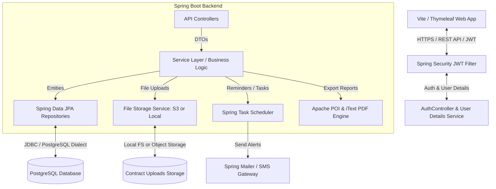
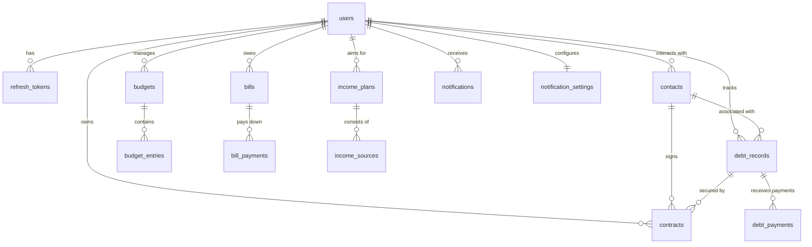

# Terimbere (Budget Management System) — System Design & Architecture
This document outlines the end-to-end technical system design, database schema, Spring Boot micro-architecture, and premium product improvement strategies for the **Terimbere Budget Management System** (named after the Kinyarwanda word for *progress*). 

---

## 1. System Architecture Overview

Terimbere is designed as a secure, high-fidelity, and modern multi-tenant application. Below is the multi-layered architecture diagram showcasing how the React/Thymeleaf/Vite client interacts with the Spring Boot backend and PostgreSQL database.



### Key Architectural Pillars:
1. **Stateless Security**: Spring Security with JSON Web Tokens (JWT) for secure REST interactions, accompanied by a secure Refresh Token mechanism stored in the database.
2. **Transactional Integrity**: Robust transactional controls (`@Transactional`) to handle double-bookings, debt repayments, and wallet deductions atomically.
3. **Decoupled Data Flow**: Strict usage of DTOs (Data Transfer Objects) mapped via **MapStruct** to isolate database entities from the front-end presentation layer.
4. **File Attachment Binding**: Contracts uploaded by users are securely stored in an AWS S3 bucket (or local persistent storage) and bound to specific contacts and debt records.

---

## 2. Complete Database Schema (PostgreSQL)

To support the 8 core features of Terimbere, we have synthesized a cohesive relational database schema. This includes the tables provided in your design specification, alongside critical new tables (for bills, payments, income plans, and notifications) required to support a fully-functional system.

### Database ERD (Entity Relationship Diagram)



---

### Phase 2.1: Authentication & User Management Tables

#### 1. `users`
Tracks registered profiles, currencies, and timezones.

| Column Name | Data Type | Constraint | Description |
| :--- | :--- | :--- | :--- |
| `id` | `UUID` | **PK**, Default UUID v4 | Unique identifier for each user |
| `email` | `VARCHAR(255)` | **UNIQUE**, **NOT NULL** | User's email (login identifier) |
| `password_hash` | `VARCHAR` | **NOT NULL** | BCrypt hashed password |
| `full_name` | `VARCHAR(100)` | **NOT NULL** | User's standard display name |
| `currency_code` | `VARCHAR(3)` | Default `'RWF'` | Primary currency code (e.g. RWF, USD, EUR) |
| `timezone` | `VARCHAR(50)` | Default `'Africa/Kigali'` | User's localized timezone |
| `email_verified` | `BOOLEAN` | Default `FALSE` | Flag for email confirmation status |
| `created_at` | `TIMESTAMP` | Default `CURRENT_TIMESTAMP` | Profile creation date and time |

#### 2. `refresh_tokens`
Manages JWT token refresh cycles, enabling long-lived sessions safely.

| Column Name | Data Type | Constraint | Description |
| :--- | :--- | :--- | :--- |
| `id` | `UUID` | **PK**, Default UUID v4 | Token record identifier |
| `user_id` | `UUID` | **FK** (`users.id`), **NOT NULL** | Links token to the user |
| `token` | `VARCHAR` | **NOT NULL**, **UNIQUE** | Hashed refresh token value |
| `expires_at` | `TIMESTAMP` | **NOT NULL** | Expiry date-time |
| `revoked` | `BOOLEAN` | Default `FALSE` | Revocation flag for manual logouts |

---

### Phase 2.2: Budgeting Tables

#### 3. `budgets`
Defines budget books (e.g. "Home Budget 2026", "Business Q2").

| Column Name | Data Type | Constraint | Description |
| :--- | :--- | :--- | :--- |
| `id` | `UUID` | **PK**, Default UUID v4 | Unique budget ID |
| `user_id` | `UUID` | **FK** (`users.id`), **NOT NULL** | Budget owner |
| `name` | `VARCHAR(150)` | **NOT NULL** | Name (e.g., "Home Budget 2026") |
| `description` | `TEXT` | Nullable | General notes |
| `period_type` | `VARCHAR(30)` | CHECK ENUM | `MONTHLY`, `QUARTERLY`, `YEARLY`, `CUSTOM` |
| `start_date` | `DATE` | **NOT NULL** | Budget cycle start date |
| `end_date` | `DATE` | **NOT NULL** | Budget cycle end date |
| `status` | `VARCHAR(20)` | CHECK ENUM | `ACTIVE`, `ARCHIVED`, `DRAFT` |
| `created_at` | `TIMESTAMP` | Default `CURRENT_TIMESTAMP` | Date created |

#### 4. `budget_entries`
Records structural income and expense rows inside a budget.

| Column Name | Data Type | Constraint | Description |
| :--- | :--- | :--- | :--- |
| `id` | `UUID` | **PK**, Default UUID v4 | Entry ID |
| `budget_id` | `UUID` | **FK** (`budgets.id`), **NOT NULL** | Target budget |
| `entry_type` | `VARCHAR(10)` | CHECK ENUM | `INCOME`, `EXPENSE` |
| `category` | `VARCHAR(100)` | **NOT NULL** | Category (e.g., Salary, Rent, Food) |
| `description` | `VARCHAR(255)` | Nullable | Detail of the entry |
| `planned_amount`| `DECIMAL(15,2)`| **NOT NULL** | Planned projection amount |
| `actual_amount` | `DECIMAL(15,2)`| Default `0.00` | Realized spent/earned amount |
| `entry_date` | `DATE` | **NOT NULL** | Date the entry took place |

---

### Phase 2.3: Contacts & Debt Tables

#### 5. `contacts`
Stores information about debtors, creditors, and commercial contacts.

| Column Name | Data Type | Constraint | Description |
| :--- | :--- | :--- | :--- |
| `id` | `UUID` | **PK**, Default UUID v4 | Contact ID |
| `user_id` | `UUID` | **FK** (`users.id`), **NOT NULL** | Associated system user |
| `full_name` | `VARCHAR(150)` | **NOT NULL** | Full name of contact |
| `phone` | `VARCHAR(20)` | Nullable | Phone number |
| `email` | `VARCHAR(255)` | Nullable | Email address |
| `address` | `TEXT` | Nullable | Physical address |
| `contact_type` | `VARCHAR(20)` | CHECK ENUM | `DEBTOR`, `CREDITOR`, `BOTH` |
| `notes` | `TEXT` | Nullable | Custom background information |

#### 6. `debt_records`
Core records tracking what people owe you and what you owe others.

| Column Name | Data Type | Constraint | Description |
| :--- | :--- | :--- | :--- |
| `id` | `UUID` | **PK**, Default UUID v4 | Debt record ID |
| `contact_id` | `UUID` | **FK** (`contacts.id`), **NOT NULL** | Target contact |
| `user_id` | `UUID` | **FK** (`users.id`), **NOT NULL** | Target user |
| `debt_direction`| `VARCHAR(20)` | CHECK ENUM | `THEY_OWE_ME`, `I_OWE_THEM` |
| `original_amount`| `DECIMAL(15,2)`| **NOT NULL** | Original principle amount |
| `remaining_amount`| `DECIMAL(15,2)`| **NOT NULL** | Balance remaining (updated via payments) |
| `due_date` | `DATE` | **NOT NULL** | Target pay-off date |
| `status` | `VARCHAR(20)` | CHECK ENUM | `ACTIVE`, `PARTIALLY_PAID`, `PAID`, `OVERDUE` |
| `created_at` | `TIMESTAMP` | Default `CURRENT_TIMESTAMP` | Creation date |

#### 7. `debt_payments` `[NEW]`
Enables rich partial payment history, resolving tracking issues for complex debts.

| Column Name | Data Type | Constraint | Description |
| :--- | :--- | :--- | :--- |
| `id` | `UUID` | **PK**, Default UUID v4 | Payment transaction ID |
| `debt_record_id`| `UUID` | **FK** (`debt_records.id`), **NOT NULL**| Linked debt |
| `amount_paid` | `DECIMAL(15,2)`| **NOT NULL** | Paid sum |
| `payment_date` | `TIMESTAMP` | **NOT NULL** | Sampled timestamp of payment receipt |
| `payment_method`| `VARCHAR(50)` | Nullable | e.g. Mobile Money, Cash, Bank Transfer |
| `notes` | `TEXT` | Nullable | Transaction details |
| `created_at` | `TIMESTAMP` | Default `CURRENT_TIMESTAMP` | Audit log timestamp |

---

### Phase 2.4: Uploaded Contracts Table

#### 8. `contracts`
Stores contracts signed between users and contacts, enabling quick legal access.

| Column Name | Data Type | Constraint | Description |
| :--- | :--- | :--- | :--- |
| `id` | `UUID` | **PK**, Default UUID v4 | Contract ID |
| `user_id` | `UUID` | **FK** (`users.id`), **NOT NULL** | Owner of the document |
| `contact_id` | `UUID` | **FK** (`contacts.id`), **NOT NULL** | Signatory contact |
| `debt_record_id`| `UUID` | **FK** (`debt_records.id`), Nullable | Secured debt record, if applicable |
| `title` | `VARCHAR(255)` | **NOT NULL** | Contract title (e.g. "Rent Agreement") |
| `file_path` | `VARCHAR` | **NOT NULL** | Store URL/URI (e.g., S3 URL or Local path) |
| `file_type` | `VARCHAR(20)` | **NOT NULL** | MIME Extension: PDF, PNG, JPEG, DOCX |
| `start_date` | `DATE` | Nullable | Contract activation date |
| `end_date` | `DATE` | Nullable | Expiry/Obligation due date |
| `notes` | `TEXT` | Nullable | Terms summary |
| `uploaded_at` | `TIMESTAMP` | Default `CURRENT_TIMESTAMP` | Date uploaded |

---

### Phase 2.5: Bills & Income Planning Tables

#### 9. `bills` `[NEW]`
Manages utility bills, subscriptions, and recurring commitments.

| Column Name | Data Type | Constraint | Description |
| :--- | :--- | :--- | :--- |
| `id` | `UUID` | **PK**, Default UUID v4 | Bill ID |
| `user_id` | `UUID` | **FK** (`users.id`), **NOT NULL** | Owner of bill |
| `title` | `VARCHAR(150)` | **NOT NULL** | Bill label (e.g., "MTN Fiber Internet") |
| `category` | `VARCHAR(100)` | **NOT NULL** | Category (Utilities, Rent, Subscription) |
| `amount` | `DECIMAL(15,2)`| **NOT NULL** | Obligation amount |
| `due_date` | `DATE` | **NOT NULL** | Next payment due date |
| `is_recurring` | `BOOLEAN` | Default `FALSE` | Recurring toggle |
| `recurrence_period`| `VARCHAR(20)`| CHECK ENUM | `ONCE`, `WEEKLY`, `MONTHLY`, `YEARLY` |
| `status` | `VARCHAR(20)` | CHECK ENUM | `UNPAID`, `PAID`, `OVERDUE` |
| `notes` | `TEXT` | Nullable | Context notes |
| `created_at` | `TIMESTAMP` | Default `CURRENT_TIMESTAMP` | Row creation timestamp |

#### 10. `bill_payments` `[NEW]`
Tracks structural cash outflows linked directly to recurrent bills.

| Column Name | Data Type | Constraint | Description |
| :--- | :--- | :--- | :--- |
| `id` | `UUID` | **PK**, Default UUID v4 | Payment item ID |
| `bill_id` | `UUID` | **FK** (`bills.id`), **NOT NULL** | Associated Bill |
| `amount_paid` | `DECIMAL(15,2)`| **NOT NULL** | Amount spent |
| `payment_date` | `TIMESTAMP` | **NOT NULL** | Date of payment |
| `payment_method`| `VARCHAR(50)` | Nullable | Mobile Money, Card, Bank |
| `transaction_ref`| `VARCHAR(100)`| Nullable | Reference tracking code |

#### 11. `income_plans` `[NEW]`
Encapsulates targets and strategies to generate money.

| Column Name | Data Type | Constraint | Description |
| :--- | :--- | :--- | :--- |
| `id` | `UUID` | **PK**, Default UUID v4 | Plan ID |
| `user_id` | `UUID` | **FK** (`users.id`), **NOT NULL** | User planning income |
| `title` | `VARCHAR(150)` | **NOT NULL** | e.g. "Agricultural Crop Yield Sales" |
| `target_amount` | `DECIMAL(15,2)`| **NOT NULL** | Monetary goal |
| `target_date` | `DATE` | **NOT NULL** | Expected realization date |
| `strategy_notes`| `TEXT` | Nullable | Detailed action plan, bullet points |
| `status` | `VARCHAR(20)` | CHECK ENUM | `DRAFT`, `ACTIVE`, `ACHIEVED`, `ABANDONED` |
| `created_at` | `TIMESTAMP` | Default `CURRENT_TIMESTAMP` | Log date |

#### 12. `income_sources` `[NEW]`
Supports breaking down income plans into several individual expected pipelines.

| Column Name | Data Type | Constraint | Description |
| :--- | :--- | :--- | :--- |
| `id` | `UUID` | **PK**, Default UUID v4 | Pipeline source ID |
| `income_plan_id`| `UUID` | **FK** (`income_plans.id`), **NOT NULL**| Owner plan |
| `source_name` | `VARCHAR(150)` | **NOT NULL** | e.g., "Supermarket Wholesale Delivery" |
| `expected_amount`| `DECIMAL(15,2)`| **NOT NULL** | Planned sum |
| `received_amount`| `DECIMAL(15,2)`| Default `0.00` | Realized collected sum |
| `status` | `VARCHAR(20)` | CHECK ENUM | `PENDING`, `PARTIAL`, `RECEIVED` |

---

### Phase 2.6: Notifications & Reminders

#### 13. `notifications` `[NEW]`
Centralized tracking for all push and email reminders.

| Column Name | Data Type | Constraint | Description |
| :--- | :--- | :--- | :--- |
| `id` | `UUID` | **PK**, Default UUID v4 | Notification ID |
| `user_id` | `UUID` | **FK** (`users.id`), **NOT NULL** | Recipient user |
| `title` | `VARCHAR(255)` | **NOT NULL** | Notification Title |
| `message` | `TEXT` | **NOT NULL** | Text content body |
| `notification_type`| `VARCHAR(30)` | CHECK ENUM | `BILL_REMINDER`, `DEBT_REMINDER`, `CONTRACT_EXPIRY`, `BUDGET_ALERT` |
| `reference_id` | `UUID` | Nullable | ID pointing to related Bill/Debt/Contract |
| `read_status` | `BOOLEAN` | Default `FALSE` | Checked/Unchecked status |
| `scheduled_at` | `TIMESTAMP` | **NOT NULL** | Date-time to execute notification |
| `sent_at` | `TIMESTAMP` | Nullable | Date-time successfully delivered |
| `created_at` | `TIMESTAMP` | Default `CURRENT_TIMESTAMP` | Row creation timestamp |

#### 14. `notification_settings` `[NEW]`
User-centric toggles for granular reminder management.

| Column Name | Data Type | Constraint | Description |
| :--- | :--- | :--- | :--- |
| `user_id` | `UUID` | **PK**, **FK** (`users.id`) | Links 1-to-1 to users |
| `email_notifications`| `BOOLEAN`| Default `TRUE` | Enable/Disable system emails |
| `in_app_notifications`| `BOOLEAN`| Default `TRUE` | Enable/Disable web feed alerts |
| `days_before_bill_reminder`| `INTEGER`| Default `3` | Countdown days trigger for bills |
| `days_before_contract_expiry`| `INTEGER`| Default `7` | Countdown days trigger for contracts |

---

## 3. Spring Boot Micro-Architecture & Entities

### Recommended Directory / Package Layout
```
com.terimbere.budget
├── TerimbereApplication.java
├── config
│   ├── SecurityConfig.java         # Spring Security 6 & WebMvc JWT setup
│   ├── AppConfig.java              # General configuration beans
│   └── AuditingConfig.java         # JPA Auditing for timestamps
├── controller
│   ├── AuthController.java         # Sign-in, Sign-up, token refresh
│   ├── BudgetController.java       # Budgets and budget entries CRUD
│   ├── DebtController.java         # Contacts, debt records, partial payments
│   ├── BillController.java         # Bills management
│   ├── ContractController.java     # Multipart file contract uploads
│   ├── IncomePlanController.java   # Goal planning and strategy logs
│   ├── NotificationController.java # User feed alerts & preferences
│   └── ReportController.java       # PDF/Excel downloads endpoint
├── model
│   ├── User.java                   # User entity
│   ├── Budget.java                 # Budget entity (OneToMany entries)
│   ├── BudgetEntry.java            # Individual Entry
│   ├── Contact.java                # Debtor/Creditor Profile
│   ├── DebtRecord.java             # Core debt record
│   ├── DebtPayment.java            # Payments tracking
│   ├── Contract.java               # Physical uploaded contract data
│   ├── Bill.java                   # Utility bills entity
│   ├── IncomePlan.java             # Strategic plan entity
│   └── Notification.java           # Alerts entity
├── repository
│   ├── UserRepository.java
│   ├── BudgetRepository.java
│   └── DebtRecordRepository.java   # Custom JPQL and Native queries
├── service
│   ├── UserService.java
│   ├── BudgetService.java
│   ├── DebtService.java            # Automatic calculations for balances
│   ├── ContractStorageService.java # Local/S3 multipart upload file logic
│   ├── NotificationService.java    # Triggers schedule-based alarms
│   └── ReportService.java          # Aggregates bytes for PDF/Excel exports
├── dto
│   ├── request
│   │   ├── LoginRequest.java
│   │   └── BudgetEntryRequest.java
│   └── response
│       ├── BudgetSummaryResponse.java
│       └── DashboardStatsResponse.java
├── exception
│   ├── GlobalExceptionHandler.java # Maps exceptions to HTTP codes
│   └── ResourceNotFoundException.java
└── security
    ├── JwtTokenProvider.java       # Validates/Generates JWTs
    ├── JwtAuthenticationFilter.java# Intercepts REST calls to verify authorization
    └── CustomUserDetailsService.java
```

---

## 4. Key Java JPA Mapping Implementation Examples

Here are exact JPA entity models showing how relations and data formats should be written in Spring Boot to map correctly to PostgreSQL.

### 4.1 `Budget.java` Entity with `OneToMany` Cascading entries
```java
package com.terimbere.budget.model;

import jakarta.persistence.*;
import lombok.*;
import org.hibernate.annotations.CreationTimestamp;
import java.time.LocalDate;
import java.time.LocalDateTime;
import java.util.ArrayList;
import java.util.List;
import java.util.UUID;

@Entity
@Table(name = "budgets")
@Getter @Setter
@NoArgsConstructor @AllArgsConstructor
@Builder
public class Budget {
    @Id
    @GeneratedValue(strategy = GenerationType.UUID)
    private UUID id;

    @ManyToOne(fetch = FetchType.LAZY)
    @JoinColumn(name = "user_id", nullable = false)
    private User user;

    @Column(nullable = false, length = 150)
    private String name;

    @Column(columnDefinition = "TEXT")
    private String description;

    @Column(name = "period_type", nullable = false, length = 30)
    private String periodType; // ENUM: MONTHLY, QUARTERLY, YEARLY, CUSTOM

    @Column(name = "start_date", nullable = false)
    private LocalDate startDate;

    @Column(name = "end_date", nullable = false)
    private LocalDate endDate;

    @Column(nullable = false, length = 20)
    private String status; // ENUM: ACTIVE, ARCHIVED, DRAFT

    @CreationTimestamp
    @Column(name = "created_at", updatable = false)
    private LocalDateTime createdAt;

    @OneToMany(mappedBy = "budget", cascade = CascadeType.ALL, orphanRemoval = true)
    @Builder.Default
    private List<BudgetEntry> entries = new ArrayList<>();

    // Helper methods to keep bi-directional relations intact
    public void addEntry(BudgetEntry entry) {
        entries.add(entry);
        entry.setBudget(this);
    }

    public void removeEntry(BudgetEntry entry) {
        entries.remove(entry);
        entry.setBudget(null);
    }
}
```

### 4.2 `DebtRecord.java` with Automatic Balance Calculations
When partial payments are made, we use custom methods to maintain and audit the remaining balance.
```java
package com.terimbere.budget.model;

import jakarta.persistence.*;
import lombok.*;
import org.hibernate.annotations.CreationTimestamp;
import java.math.BigDecimal;
import java.time.LocalDate;
import java.time.LocalDateTime;
import java.util.UUID;

@Entity
@Table(name = "debt_records")
@Getter @Setter
@NoArgsConstructor @AllArgsConstructor
@Builder
public class DebtRecord {
    @Id
    @GeneratedValue(strategy = GenerationType.UUID)
    private UUID id;

    @ManyToOne(fetch = FetchType.LAZY)
    @JoinColumn(name = "contact_id", nullable = false)
    private Contact contact;

    @ManyToOne(fetch = FetchType.LAZY)
    @JoinColumn(name = "user_id", nullable = false)
    private User user;

    @Column(name = "debt_direction", nullable = false, length = 20)
    private String debtDirection; // ENUM: THEY_OWE_ME, I_OWE_THEM

    @Column(name = "original_amount", nullable = false, precision = 15, scale = 2)
    private BigDecimal originalAmount;

    @Column(name = "remaining_amount", nullable = false, precision = 15, scale = 2)
    private BigDecimal remainingAmount;

    @Column(name = "due_date", nullable = false)
    private LocalDate dueDate;

    @Column(nullable = false, length = 20)
    private String status; // ENUM: ACTIVE, PARTIALLY_PAID, PAID, OVERDUE

    @CreationTimestamp
    @Column(name = "created_at", updatable = false)
    private LocalDateTime createdAt;
}
```

---

## 5. Modern Features & Premium Value Propositions

To make **Terimbere** highly engaging and generate direct customer interest, we recommend implementing these modern enhancements:

### 5.1 Smart Cash Flow Forecasting (Visual Runway)
Do not just list static data. We will create a predictive service that maps:
`Expected Cash Flow = (Planned Budgets + Active Income Goals) - (Recurring Bills + Overdue Debts)`
*   **Result**: Displays a dynamic dashboard line graph projecting the user's available funds up to 12 months ahead, warning them exactly when a cash flow crunch will occur.

### 5.2 Contract OCR & Automatic Form Extraction
Upload a contract (PDF/Image) and automatically pre-fill the form:
*   Use a lightweight cloud-based OCR or an AI prompt API to scan the document for keywords like *"Payable sum"*, *"Contract End Date"*, and *"Debtor Name"*.
*   **Result**: Replaces 80% of typing with one drag-and-drop, making debt registration smooth and painless.

### 5.3 Automated Debtor Payment Reminders via WhatsApp & SMS
Provide single-click notification links:
*   Integrate a gateway (e.g. Twilio or local gateways in Rwanda like Africa's Talking) to generate SMS/WhatsApp templates: *"Hi [Debtor Name], this is a gentle reminder that your contract payment of [Amount] is due on [Date]. Click here to settle via Mobile Money [Link]"*.
*   **Result**: Greatly increases recovery speed for users, turning Terimbere from a tracker into an **active financial assistant**.

### 5.4 Automated Report Downloads Engine
Users expect beautifully formatted PDF statements and structured Excel workbooks.
*   **PDF Exports (using iText / OpenPDF)**: Build clean, styled PDF reports with the "Terimbere" branding, summary pie charts, and full itemized tables.
*   **Excel Exports (using Apache POI)**: Design dynamic Excel templates with embedded formula cells (e.g. `SUM`, `AVERAGE`) so users can continue their analysis locally.

---

## 6. Implementation Checklist & Database Setup

To spin up this database immediately inside your Spring Boot application's `/src/main/resources/schema.sql` (or via Flyway migration files), use the following SQL script:

```sql
-- Create custom ENUMS as constraints (PostgreSQL natively supports VARCHAR with CHECK constraints which is safer for schema migration)

CREATE TABLE users (
    id UUID PRIMARY KEY DEFAULT gen_random_uuid(),
    email VARCHAR(255) UNIQUE NOT NULL,
    password_hash VARCHAR(255) NOT NULL,
    full_name VARCHAR(100) NOT NULL,
    currency_code VARCHAR(3) DEFAULT 'RWF',
    timezone VARCHAR(50) DEFAULT 'Africa/Kigali',
    email_verified BOOLEAN DEFAULT FALSE,
    created_at TIMESTAMP DEFAULT CURRENT_TIMESTAMP
);

CREATE TABLE refresh_tokens (
    id UUID PRIMARY KEY DEFAULT gen_random_uuid(),
    user_id UUID NOT NULL REFERENCES users(id) ON DELETE CASCADE,
    token VARCHAR(500) NOT NULL UNIQUE,
    expires_at TIMESTAMP NOT NULL,
    revoked BOOLEAN DEFAULT FALSE
);

CREATE TABLE budgets (
    id UUID PRIMARY KEY DEFAULT gen_random_uuid(),
    user_id UUID NOT NULL REFERENCES users(id) ON DELETE CASCADE,
    name VARCHAR(150) NOT NULL,
    description TEXT,
    period_type VARCHAR(30) NOT NULL CHECK (period_type IN ('MONTHLY', 'QUARTERLY', 'YEARLY', 'CUSTOM')),
    start_date DATE NOT NULL,
    end_date DATE NOT NULL,
    status VARCHAR(20) NOT NULL CHECK (status IN ('ACTIVE', 'ARCHIVED', 'DRAFT')),
    created_at TIMESTAMP DEFAULT CURRENT_TIMESTAMP
);

CREATE TABLE budget_entries (
    id UUID PRIMARY KEY DEFAULT gen_random_uuid(),
    budget_id UUID NOT NULL REFERENCES budgets(id) ON DELETE CASCADE,
    entry_type VARCHAR(10) NOT NULL CHECK (entry_type IN ('INCOME', 'EXPENSE')),
    category VARCHAR(100) NOT NULL,
    description VARCHAR(255),
    planned_amount DECIMAL(15,2) NOT NULL,
    actual_amount DECIMAL(15,2) DEFAULT 0.00,
    entry_date DATE NOT NULL
);

CREATE TABLE contacts (
    id UUID PRIMARY KEY DEFAULT gen_random_uuid(),
    user_id UUID NOT NULL REFERENCES users(id) ON DELETE CASCADE,
    full_name VARCHAR(150) NOT NULL,
    phone VARCHAR(20),
    email VARCHAR(255),
    address TEXT,
    contact_type VARCHAR(20) NOT NULL CHECK (contact_type IN ('DEBTOR', 'CREDITOR', 'BOTH')),
    notes TEXT
);

CREATE TABLE debt_records (
    id UUID PRIMARY KEY DEFAULT gen_random_uuid(),
    contact_id UUID NOT NULL REFERENCES contacts(id) ON DELETE RESTRICT,
    user_id UUID NOT NULL REFERENCES users(id) ON DELETE CASCADE,
    debt_direction VARCHAR(20) NOT NULL CHECK (debt_direction IN ('THEY_OWE_ME', 'I_OWE_THEM')),
    original_amount DECIMAL(15,2) NOT NULL,
    remaining_amount DECIMAL(15,2) NOT NULL,
    due_date DATE NOT NULL,
    status VARCHAR(20) NOT NULL CHECK (status IN ('ACTIVE', 'PARTIALLY_PAID', 'PAID', 'OVERDUE')),
    created_at TIMESTAMP DEFAULT CURRENT_TIMESTAMP
);

CREATE TABLE debt_payments (
    id UUID PRIMARY KEY DEFAULT gen_random_uuid(),
    debt_record_id UUID NOT NULL REFERENCES debt_records(id) ON DELETE CASCADE,
    amount_paid DECIMAL(15,2) NOT NULL,
    payment_date TIMESTAMP NOT NULL,
    payment_method VARCHAR(50),
    notes TEXT,
    created_at TIMESTAMP DEFAULT CURRENT_TIMESTAMP
);

CREATE TABLE contracts (
    id UUID PRIMARY KEY DEFAULT gen_random_uuid(),
    user_id UUID NOT NULL REFERENCES users(id) ON DELETE CASCADE,
    contact_id UUID NOT NULL REFERENCES contacts(id) ON DELETE CASCADE,
    debt_record_id UUID REFERENCES debt_records(id) ON DELETE SET NULL,
    title VARCHAR(255) NOT NULL,
    file_path VARCHAR(500) NOT NULL,
    file_type VARCHAR(20) NOT NULL,
    start_date DATE,
    end_date DATE,
    notes TEXT,
    uploaded_at TIMESTAMP DEFAULT CURRENT_TIMESTAMP
);

CREATE TABLE bills (
    id UUID PRIMARY KEY DEFAULT gen_random_uuid(),
    user_id UUID NOT NULL REFERENCES users(id) ON DELETE CASCADE,
    title VARCHAR(150) NOT NULL,
    category VARCHAR(100) NOT NULL,
    amount DECIMAL(15,2) NOT NULL,
    due_date DATE NOT NULL,
    is_recurring BOOLEAN DEFAULT FALSE,
    recurrence_period VARCHAR(20) NOT NULL CHECK (recurrence_period IN ('ONCE', 'WEEKLY', 'MONTHLY', 'YEARLY')),
    status VARCHAR(20) NOT NULL CHECK (status IN ('UNPAID', 'PAID', 'OVERDUE')),
    notes TEXT,
    created_at TIMESTAMP DEFAULT CURRENT_TIMESTAMP
);

CREATE TABLE bill_payments (
    id UUID PRIMARY KEY DEFAULT gen_random_uuid(),
    bill_id UUID NOT NULL REFERENCES bills(id) ON DELETE CASCADE,
    amount_paid DECIMAL(15,2) NOT NULL,
    payment_date TIMESTAMP NOT NULL,
    payment_method VARCHAR(50),
    transaction_ref VARCHAR(100)
);

CREATE TABLE income_plans (
    id UUID PRIMARY KEY DEFAULT gen_random_uuid(),
    user_id UUID NOT NULL REFERENCES users(id) ON DELETE CASCADE,
    title VARCHAR(150) NOT NULL,
    target_amount DECIMAL(15,2) NOT NULL,
    target_date DATE NOT NULL,
    strategy_notes TEXT,
    status VARCHAR(20) NOT NULL CHECK (status IN ('DRAFT', 'ACTIVE', 'ACHIEVED', 'ABANDONED')),
    created_at TIMESTAMP DEFAULT CURRENT_TIMESTAMP
);

CREATE TABLE income_sources (
    id UUID PRIMARY KEY DEFAULT gen_random_uuid(),
    income_plan_id UUID NOT NULL REFERENCES income_plans(id) ON DELETE CASCADE,
    source_name VARCHAR(150) NOT NULL,
    expected_amount DECIMAL(15,2) NOT NULL,
    received_amount DECIMAL(15,2) DEFAULT 0.00,
    status VARCHAR(20) NOT NULL CHECK (status IN ('PENDING', 'PARTIAL', 'RECEIVED'))
);

CREATE TABLE notifications (
    id UUID PRIMARY KEY DEFAULT gen_random_uuid(),
    user_id UUID NOT NULL REFERENCES users(id) ON DELETE CASCADE,
    title VARCHAR(255) NOT NULL,
    message TEXT NOT NULL,
    notification_type VARCHAR(30) NOT NULL CHECK (notification_type IN ('BILL_REMINDER', 'DEBT_REMINDER', 'CONTRACT_EXPIRY', 'BUDGET_ALERT')),
    reference_id UUID,
    read_status BOOLEAN DEFAULT FALSE,
    scheduled_at TIMESTAMP NOT NULL,
    sent_at TIMESTAMP,
    created_at TIMESTAMP DEFAULT CURRENT_TIMESTAMP
);

CREATE TABLE notification_settings (
    user_id UUID PRIMARY KEY REFERENCES users(id) ON DELETE CASCADE,
    email_notifications BOOLEAN DEFAULT TRUE,
    in_app_notifications BOOLEAN DEFAULT TRUE,
    days_before_bill_reminder INT DEFAULT 3,
    days_before_contract_expiry INT DEFAULT 7
);
```

---

## 7. Strategic Growth Strategy (Making Users Interested)

To turn Terimbere into a product people actively love and share, we propose focusing on three human elements:

1.  **Low Friction Onboarding**: 
    Allow users to sign up using standard social auth (Google/OAuth2) or phone numbers (popular in East Africa). Do not force complex credentials upfront. Give them a "Quick Budget Setup Wizard" where they can enter their main monthly income and fixed bills in 30 seconds.
2.  **Interactive Visualizations (Visual Delight)**:
    Build beautiful, custom dashboard components using charts (like Chart.js or Recharts). Implement a vibrant, glassmorphism design themed around rich, positive African tones (harmonious greens representing growth, soft warm tones representing progress).
3.  **Action-Oriented Alarms (In-App & Email/SMS)**:
    Rather than forcing users to check the app daily, Terimbere sends value-added reminders: *"Your water bill is due in 3 days. Settle now to avoid a fine"*. This positions the app as a reliable companion, keeping users highly engaged.
